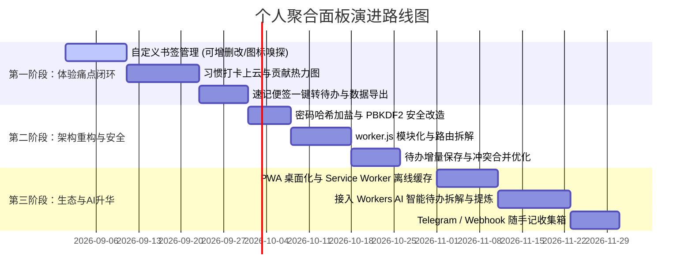

# 个人聚合面板 (Digital Garden) 进阶优化与演化规划书

> **版本**：v2.0 (Next Phase Roadmap)  
> **更新时间**：2026-09  
> **适用环境**：Cloudflare Workers + D1 + KV + Assets  
> **目标定位**：将聚合面板从“多功能单点工具集合”升华为“高粘度、有温度、数据闭环的专属数字生活与生产力中枢”。

---

## 目录
1. [项目现状评估与痛点复盘](#一项目现状评估与痛点复盘)
2. [核心优化领域与技术设计](#二核心优化领域与技术设计)
   - [领域 1：生活节奏深化与数据流转闭环](#1-生活节奏深化与数据流转闭环)
   - [领域 2：Cloudflare 云原生深度赋能与 AI 拓展](#2-cloudflare-云原生深度赋能与-ai-拓展)
   - [领域 3：工程架构重构与安全加固](#3-工程架构重构与安全加固)
   - [领域 4：客户端形态与离线体验 (PWA)](#4-客户端形态与离线体验-pwa)
3. [数据库升级设计 (D1 Schema 迁移方案)](#三数据库升级设计-d1-schema-迁移方案)
4. [阶段性实施路线图与优先级](#四阶段性实施路线图与优先级)

---

## 一、项目现状评估与痛点复盘

### 1.1 既有里程碑达成
在经历了初期版本的快速迭代后，项目已具备扎实的基础：
- **全栈 Serverless 化**：基于 Cloudflare Workers + D1 数据库 + KV 会话存储 + Assets 静态托管，具备零成本、边缘高可用的优势。
- **丰富的工具矩阵**：拥有 18+ 款涵盖日常与开发的独立小工具（Markdown、Diff、SM2、图片工坊、OpenCV 美颜等）及 4 款休闲游戏。
- **沉浸式视觉体系**：具有纸质质感的深浅色主题、毛玻璃效果、Launchpad (Ctrl+K) 快捷检索。
- **云端功能初现**：待办事项（Todos）、代码便签（Snippets）、故事花园（Stories）已接入 D1 存储。

### 1.2 当前的核心痛点分析
1. **数据流动相对孤立**：
   - “灵感速记”与“今日待办”相互独立，灵感无法一键沉淀为执行事项。
   - “习惯打卡 (Daily Rituals)”仍停留在本地 `localStorage`，更换设备或清理缓存后连击天数（Streak）丢失。
2. **个性化定制不足**：
   - 侧边栏的“常用书签”写死在 HTML 中，用户无法在前端直接增删改自己的私人导航。
3. **存在安全与并发隐患**：
   - 密码哈希仅使用纯 `SHA-256`，未加盐（Salt），面临彩虹表风险。
   - 待办同步采用全量 `DELETE + INSERT` 批处理，多设备并发编辑时存在相互覆盖风险。
4. **后端单文件膨胀**：
   - `src/worker.js` 已达 500+ 行，集成了路由分发、中间件、鉴权和各类业务逻辑，可维护性随功能扩展而下降。

---

## 二、核心优化领域与技术设计

### 1. 生活节奏深化与数据流转闭环

#### 1.1 自定义书签导航（高频强需求）
- **功能描述**：
  - 侧边栏“常用书签”卡片支持交互式编辑：新增、修改名称/链接、删除、拖拽排序。
  - 智能嗅探网站图标：输入网址后自动获取对应站点的 Favicon（如通过 Google Favicon 服务或解析 HTML）。
- **存储方案**：
  - 登录用户保存至 D1 `user_preferences` 表中的 `custom_settings.bookmarks` 字段；未登录用户回退至 `localStorage`。

#### 1.2 习惯打卡云端持久化与打卡热力图
- **功能描述**：
  - 支持自定义习惯项（名称、图标、打卡周期），摆脱默认 5 项的限制。
  - 增加类似 **GitHub Contribution 的年度/月度打卡热力方块图**，清晰展现每日完成率与连续打卡节奏。
- **存储方案**：
  - 在 D1 中建立 `habits`（习惯定义）与 `habit_logs`（每日打卡明细）两张表，打卡事件毫秒级同步。

#### 1.3 碎片信息转化闭环（速记 ➔ 待办 / 知识库）
- **功能描述**：
  - **速记一键转待办**：速记输入框中的选中文字或某一行，点击悬浮按钮即可直接提取为右侧的一条“今日待办”。
  - **速记转为故事草稿**：长篇随笔一键转存至管理员后台的故事草稿箱。
  - **全键盘快捷唤起**：设置全局组合键（如 `Ctrl + Shift + S`）呼出侧边快速速记浮窗。

#### 1.4 数据自主权：一键全量导出与备份
- **功能描述**：
  - 在个人名片或设置中提供“导出我的数据”功能。
  - 一键打包生成 `.json` 或 `.zip` 归档包（包含待办列表、习惯打卡日志、速记历史、代码片段），消除数据被锁定的顾虑。

---

### 2. Cloudflare 云原生深度赋能与 AI 拓展

#### 2.1 接入 Cloudflare Workers AI（免费大模型能力）
Workers AI 每日提供大量免费推理额度，且完全在边缘原生运行，无需购买第三方 API 密钥。
- **待办任务智能拆解**：
  - 输入较为宽泛的任务（如“准备下周搬家事宜”），点击“AI 拆解”，自动由 `Llama 3` 或 `Qwen` 生成 3-5 条具体子任务填入清单。
- **灵感速记智能提炼**：
  - 对零散的灵感速记一键生成 Markdown 摘要与关键词标签。
- **每日一言深度感悟**：
  - 点击一言卡片旁的“✨ AI 解读”，生成一段 100 字左右富有哲理的心境共鸣短文。

#### 2.2 外部收集箱：Telegram Bot / Webhook 随手记
- **功能描述**：
  - 通过 Worker 开放专门的 Webhook 接口（如 `/api/webhook/memo`），对接 Telegram Bot 或企业微信机器人。
  - 当你在手机端或外出路上有任何想法，直接在聊天软件中给 Bot 发送文字或语音转文字，Worker 自动将该消息录入个人面板的“灵感速记”中，回到电脑开箱即见。

#### 2.3 Cloudflare R2 轻量图床与附件存储
- **功能描述**：
  - 绑定 Cloudflare R2 存储桶，支持在 Markdown 工具或速记中直接粘贴/拖拽上传图片，并自动返回公网访问链接。

---

### 3. 工程架构重构与安全加固

#### 3.1 密码哈希安全加固（Salt 加盐与 PBKDF2）
- **现状缺陷**：`hashPassword` 仅为单纯的 `SHA-256(text)`，缺少盐值防御。
- **改造方案**：
  - 注册时生成加密安全的随机盐（16 字节）：`crypto.getRandomValues(new Uint8Array(16))`。
  - 使用 Web Crypto API 的 `PBKDF2`（HMAC-SHA256，100,000 次迭代）生成哈希值。
  - 存储格式采用标准：`salt:hash`，验证时提取 salt 重复计算比对。

#### 3.2 后端 worker.js 路由模块化重构
- **现状缺陷**：所有 API 逻辑平铺在单个 `fetch` 函数中，条件分支交错。
- **改造方案**：
  - 建立目录 `src/routes/`，按业务拆分：
    - `src/routes/auth.js`：登录、注册、Token 续期；
    - `src/routes/todos.js`：待办增删改查；
    - `src/routes/habits.js`：习惯打卡与热力图接口；
    - `src/routes/stories.js`：故事花园流接口；
    - `src/routes/admin.js`：管理后台专用路由。
  - 可以引入轻量无依赖的 Edge 路由器或微框架（如 [Hono](https://hono.dev/)，专为 Cloudflare Workers 深度优化，仅十几 KB），让代码结构清晰规范。

#### 3.3 待办同步并发控制（增量 Patch / ID 粒度更新）
- **现状缺陷**：全量清空（DELETE）再全部插入（INSERT）不仅消耗 D1 写入次数，多端同时修改时还会发生脏数据覆盖。
- **改造方案**：
  - 给每条待办生成唯一的客户端 UUID。
  - API 提供增量更新接口：`POST /api/todos/item`（新增/修改单条）、`DELETE /api/todos/item?id=...`。
  - 同步时基于 `updated_at` 时间戳比对，实现优雅的增量合并。

---

### 4. 客户端形态与离线体验 (PWA)

#### 4.1 PWA (Progressive Web App) 独立应用化
- **功能描述**：
  - 补齐 `manifest.json` 与各尺寸高清应用图标。
  - 支持在 Chrome/Edge 浏览器中“安装到桌面”，在 iOS Safari 中“添加到主屏幕”。
  - 启动后拥有专属无边框窗口，去除浏览器地址栏与标签页干扰，体验媲美原生桌面应用。

#### 4.2 离线优先与 Service Worker 缓存
- **功能描述**：
  - 缓存主页 HTML、CSS、核心 JS 及离线小工具。
  - 在无网络或弱网环境下秒开面板，时钟、离线小工具、已缓存的待办完全可用。
  - 网络恢复后，后台自动执行双向静默同步。

---

## 三、数据库升级设计 (D1 Schema 迁移方案)

为支持“自定义习惯打卡”与“书签偏好”，建议在后续迭代中执行以下 D1 结构升级：

```sql
-- 1. 习惯项目定义表
CREATE TABLE IF NOT EXISTS habits (
  id TEXT PRIMARY KEY,
  user_id INTEGER NOT NULL,
  name TEXT NOT NULL,
  icon TEXT DEFAULT '✨',
  frequency TEXT DEFAULT 'daily', -- 周期：daily, weekly
  target_days INTEGER DEFAULT 1,
  sort_order INTEGER DEFAULT 0,
  created_at TEXT DEFAULT (datetime('now', 'localtime')),
  FOREIGN KEY (user_id) REFERENCES users(id) ON DELETE CASCADE
);

-- 2. 习惯打卡明细表 (用于热力图渲染与 Streak 计算)
CREATE TABLE IF NOT EXISTS habit_logs (
  id INTEGER PRIMARY KEY AUTOINCREMENT,
  user_id INTEGER NOT NULL,
  habit_id TEXT NOT NULL,
  check_date TEXT NOT NULL, -- 格式：YYYY-MM-DD
  created_at TEXT DEFAULT (datetime('now', 'localtime')),
  UNIQUE(user_id, habit_id, check_date),
  FOREIGN KEY (user_id) REFERENCES users(id) ON DELETE CASCADE,
  FOREIGN KEY (habit_id) REFERENCES habits(id) ON DELETE CASCADE
);

-- 3. 给 todos 表补充 uuid 与更新时间戳索引 (优化增量同步)
ALTER TABLE todos ADD COLUMN uuid TEXT;
ALTER TABLE todos ADD COLUMN updated_at TEXT DEFAULT (datetime('now', 'localtime'));
CREATE INDEX IF NOT EXISTS idx_todos_user_updated ON todos(user_id, updated_at);
```

---

## 四、阶段性实施路线图与优先级



### 推荐的近期行动指南
建议以 **“轻便、可见度高、快速获得正反馈”** 为原则推进：
1. **第 1 步**：先动手实现 **侧边栏书签的自定义编辑**（前端提供“+”按钮和编辑弹窗，配置直接存入现有的 `user_preferences` 表，无需改动现有数据库结构，见效最快）。
2. **第 2 步**：进行 **习惯打卡上云与热力图** 的开发，彻底告别浏览器缓存丢失的问题。
3. **第 3 步**：重构 `worker.js` 路由，为后续接入 Workers AI 打下整洁的代码架构。
