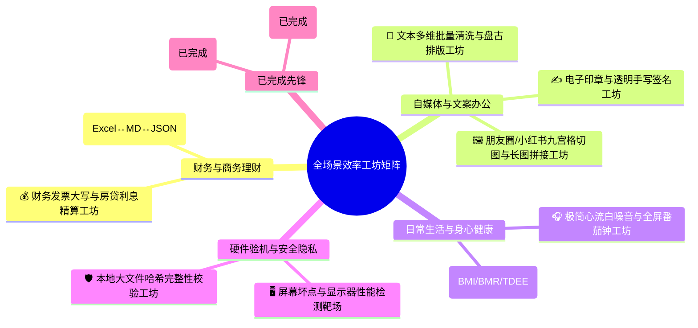
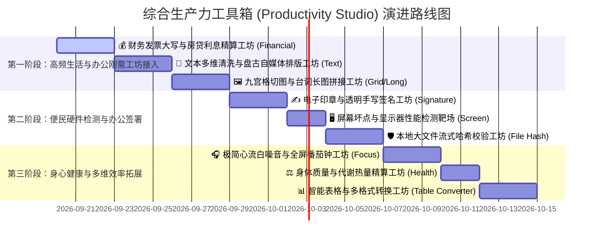

# 生产力工具箱 (Productivity Studio) 沉浸式工作台升级规划书

> **版本**：v3.1 (Multi-Disciplinary Workbench Evolution)  
> **更新时间**：2026-09  
> **核心定位**：打破以往“单纯面向程序员”的狭隘技术视角，立足浏览器原生特性（零安装、秒响应、本地隐私安全、多端通用），全面升华为 **“面向各行各业办公与日常生活的 100vh 沉浸式现代综合效率工作台 (Productivity Studio)”**。  
> **设计基准**：以全屏工作台交互规范为标杆，实现视口利用率、操作流程度与视觉质感的质变跃升。

---

## 目录
1. [背景反思与演进目标](#一背景反思与演进目标)
2. [工具箱统一交互架构与设计规范](#二工具箱统一交互架构与设计规范)
3. [已有重点工具“工作台化”翻新方案](#三已有重点工具工作台化翻新方案)
4. [新增高频常用工具矩阵 (跨行业与日常生活效率工坊)](#四新增高频常用工具矩阵-跨行业与日常生活效率工坊)
5. [工具间数据联动与状态持久化](#五工具间数据联动与状态持久化)
6. [阶段性实施路线图与优先级](#六阶段性实施路线图与优先级)

---

## 一、背景反思与演进目标

### 1.1 痛点复盘：为什么上个版本没有带来“明显的质感与效率跃升”？
在之前的版本规划中，开发重心偏向于后端底层架构（D1 数据库建表、密码加盐 PBKDF2、Workers AI 与 Telegram 收集箱）。这些改进提升了工程底座，但**脱离了该面板最核心的使用场景**：
- **核心场景错配**：用户打开该聚合面板，绝大多数场景是为了“快速解决手头的一个即时任务”（如格式化文本、算算账、查日期、图片切图/处理、查验数据）。工具的趁手度与泛用性才是第一生命线。
- **“居中小卡片”的体验局限**：大多数已有工具采用 `max-width: 900px` 的居中卡片布局。在大屏显示器下，页面两侧留白超过 50%，长内容需要深层次上下滚动，操作按钮分散，缺乏现代生产力工具的专业感。
- **全屏工作台铺满带来的质变经验**：
  - **视口最大化**：视口固定为 `100vh`，没有外层滚动穿透，空间利用率拉满；
  - **左右分栏联动**：左侧编辑输入、右侧解析预览，各自分栏独立滚动；
  - **操作栏一体化**：顶部固定 56px 沉浸式工具栏，复制、清空、换算一键即达；
  - **质感跃迁**：从“简陋的小网页”直接跃迁为“媲美专业桌面原生客户端的工作台”。

### 1.2 演进目标
本规划将以工作台规范为标杆，推进两大维度的深度升级：
1. **已有旧工具全面“工作台化”**：将零散的卡片式工具翻新为统一标准的高效全屏工作台；
2. **拓展各行各业与日常生活刚需版图**：新增发票大写/房贷精算、文本批量清洗与排版、九宫格长图拼接、电子印章与透明签名、屏幕验机靶场、心流白噪音番茄钟、身体健康代谢精算等跨行业王牌工坊。

---

## 二、工具箱统一交互架构与设计规范

为了保证整个工具箱的一致性与高质感，后续所有升级工具与新工具遵循统一的 **Workbench UI 规范**：

```
+-----------------------------------------------------------------------------------+
|  [<- 返回]  [应用图标] 应用标题 (v2.0)  |  [工具核心功能按钮组]  |  [快捷切换] [深浅色]  |  -> 56px 固定 Header
+-----------------------------------------------------------------------------------+
|                                                                                   |
|            输入工作区 (Input Area)            |         输出与分析区 (Inspector)     |  -> 100vh 自适应无外层滚动
|         - 语法高亮 / 拖拽上传 / 快捷清空        |       - 结构化树 / 预览 / 差异分析   |
|         - 行号提示 / 格式错误即时标记           |       - 1-Click 一键复制全部         |
|                                               |                                   |
+-----------------------------------------------------------------------------------+
|  [状态提示: 就绪 / 已解析 128 项]             |  [编码: UTF-8]  [字数/行数]  [发送到...]  |  -> 32px 底部状态栏
+-----------------------------------------------------------------------------------+
```

### 2.1 统一页面结构
- **顶部工具条 (Top Navbar, 56px)**：
  - 左侧：优雅的返回主页按钮、应用图标与渐变标题、版本 Badge；
  - 中间：核心操作触发器（如格式化、转换、清空、示例数据加载）；
  - 右侧：工具箱快捷抽屉触发器、主题切换按钮、全屏状态按钮。
- **主工作区 (Main Workspace)**：
  - 采用 Flexbox / CSS Grid 铺满剩余视口 (`height: calc(100vh - 56px - 32px)`)；
  - 各工作面板具备独立的纵向滚动条，支持水平拖拽改变双栏宽度（Resizer Splitter）。
- **底部状态栏 (Status Bar, 32px)**：
  - 实时显示输入字符数、行数、字节大小、执行耗时、语法有效性状态。

### 2.2 工具箱全局无缝切换抽屉 (Tool Switcher Drawer)
- 在任意工具内按 `Ctrl + K` 或点击顶部“工具切换”按钮，均可从侧边滑出半透明毛玻璃抽屉；
- 用户无需退回首页，即可在各个工具之间毫秒级切换，工具状态自动保留在内存中。

---

## 三、已有重点工具“工作台化”翻新方案

| 工具名称                                              | 当前现状与痛点 | 升级后的全新功能与工作台形态 | 优先级 |
|:--------------------------------------------------| :--- | :--- | :--- |
| **1. Base64 互转**<br>`base64_tool.html`            | 局促的 900px 居中卡片，两个 textarea 挤在一起，无法预览图片或处理大文件。 | **升级为「多模态数据编解码工作台」**【✅ 已完成】：<br>• **100vh 双栏响应式**：左侧文本/文件输入，右侧输出与操作区；<br>• **拖拽文件即转 Base64**：拖入图片直接生成 Data URL，右侧提供实时图片预览、尺寸信息及一键复制 `` / CSS 引用；<br>• **模式拓展**：增加 `URL-Safe Base64`、`Hex (十六进制) 互转`、`智能双向即时响应与防抖`。 | P0 (极高) |
| **2. 时间戳转换**<br>`timestamp_tool.html`             | 居中卡片，上下堆叠，页面滚动长，缺乏对比大盘。 | **升级为「全球时区与时间开发者工坊」**【✅ 已完成】：<br>• **全屏动态时区大盘**：毫秒级实时看板，支持北京时间 (UTC+8)、世界协调时 (UTC)、伦敦、纽约、硅谷、东京等 6 大枢纽时区联动；<br>• **多行日志批量转换**：支持一次性粘贴多行日志并批量替换时间戳；<br>• **代码速查清单**：直接提供 JS, Python, Go, Java, PHP, SQL 获取当前时间戳及互转语法的 1-click 代码片段。 | P0 (极高) |
| **3. 正则表达式测试器**<br>`regex_tool.html`              | 居中 1200px 卡片，大量滚动条嵌套，长文本匹配极其笨重。 | **升级为「Regex101 级别全屏工坊」**【✅ 已完成】：<br>• **全屏固定工作台**：上方全宽正则输入与 Flags 胶囊，左侧待测文本双层精准高亮，右侧捕获组树状分解（Group 1/2...）；<br>• **即时替换工坊**：支持 `$1`, `$2` 等反向引用替换及实时输出预览；<br>• **语法可视化说明**：自动将正则拆解为中文大白话语法解释；<br>• **内置常用规则抽屉**：20+ 常用场景（手机号、邮箱、IPv4/v6、身份证、URL、中文字符等）一键填入。 | P0 (极高) |
| **4. 正则表达式可视化生成器**<br>`regex_generator_tool.html` | 1200px 居中卡片，规则项无法拖拽调整顺序，且完全缺失实时文本测试靶场（必须跳页到测试器才能验证，体验严重割裂）。 | **升级为「可视化正则积木工坊 (Regex Builder Studio v2.0)」**【✅ 已完成】：<br>• **100vh 规则拼装双栏工作台**：左侧积木链自由构建，右侧集成生成、即时验证、大白话解析与代码导出；<br>• **规则链拖拽与自由调整**：支持规则卡片拖拽排序 (Drag & Drop)、一键克隆复制步骤、上移/下移；<br>• **内嵌即时验证靶场 (Live Tester)**：在右侧面板直接内嵌测试输入框，拼装规则变化时毫秒级显示是否匹配与命中高亮，彻底免除切页烦恼；<br>• **丰富规则类型与高级语法**：扩充支持单词边界 `\b`、字符集排除、量词贪婪/非贪婪设定、前后缀锚点；<br>• **多语言代码一键导出**：一键生成并复制 JS、Python、Go、Java、PHP 正则调用代码；<br>• **扩充实战配方库 (15+)**：覆盖手机、邮箱、身份证、统一信用码、IP、URL、中文字符等常见需求。 | P1 (高) |
| **5. 二维码生成与解析工坊**<br>`qrcode_tool.html`           | 900px 居中上下卡片堆叠，仅支持黑白纯文本生成，无法调节容错率、颜色与中心 Logo，不支持 SVG 与高清导出，解析区不支持图片拖拽。 | **升级为「全能二维码工坊 (QRCode Studio v2.0)」**【✅ 已完成】：<br>• **100vh 双栏响应式工作台**：左侧多模态模板与视觉样式定制器，右侧实时大盘与多源解码靶场；<br>• **全场景模板体系**：内置 🔗 网址/纯文本、📶 WiFi 免密连接 (SSID/密码/WPA2)、📇 电子名片 (vCard 扫码存入通讯录)、✉️ 邮件、📞 电话、💬 短信等多模态模板；<br>• **全方位样式与 Logo 定制**：自由调节纠错等级 (L/M/Q/H)、尺寸滑块 (200~1024px)、前景色/背景色拾色器 (含高雅预设色系)、嵌入中心自定义 Logo 图标并调节圆角与比例；<br>• **生产级高清导出与复制**：支持一键将二维码复制到剪贴板，支持导出 512px/1024px 高清 PNG 及无损打印级 SVG 矢量图；<br>• **多源拖拽智能解析**：支持图片拖拽 (Drag & Drop)、剪贴板粘贴与文件上传，解析结果智能识别网址一键打开、结构化名片展示。 | P1 (高) |
| **6. 密码与凭据生成**<br>`password_generator.html`       | 居中小卡片，只能单次生成单个密码，缺乏批量能力。 | **升级为「全功能凭据与安全密钥生成工坊」**【✅ 已完成】：<br>• **全模态生成**：支持密码、UUID (v4/v7)、NanoID、随机 Hex 字符串、API Key 格式；<br>• **批量生成与导出**：一键生成 10/50/100 条并提供一键复制或 `.txt` 导出；<br>• **安全熵分析**：动态展示密码熵值（Bits）及估算暴力破解所需耗时仪表盘。 | P1 (高) |
| **7. 颜色转换器**<br>`color_tool.html`                 | 只有简单的调色块和输入框，缺乏设计与代码联动。 | **升级为「调色与可访问性设计工坊」**【✅ 已完成】：<br>• **全格式互转**：HEX ↔ RGB ↔ HSL ↔ HSV ↔ CSS 变量；<br>• **WCAG 对比度检查器**：自动测试前景色与背景色的对比度得分，给出 AA/AAA 可访问性标准判定；<br>• **CSS 渐变生成器**：可视化调渐变色，实时生成代码并提供预览卡片。 | P1 (高) |
| **8. Diff 文本对比**<br>`diff_tool.html`              | 已经是全屏，但功能偏基础，缺乏高级对比开关。 | **体验深度增强**【✅ 已完成】：<br>• **高级过滤开关**：新增“忽略大小写”、“忽略空白字符”、“行内字符级差异细粒度高亮”；<br>• **文件拖拽对比**：支持直接将两个本地文本或代码文件拖入对比；<br>• **一键左右互换**：便于比对与回退检查。 | P1 (高) |
| **9. 科学与工程单位换算**<br>`unit_converter.html`      | 传统纵向滚动长页，两边留白过多，无 100vh 规范与状态栏，缺失右上角工具箱抽屉联动；缺失 CSS 视口度量衡与网络带宽换算；进制转换缺少内存类型视图与位运算。 | **升级为「全能科学与工程单位换算工坊 (Unit & Radix Studio v2.0)」**【✅ 已完成】：<br>• **100vh 现代工作台**：56px 顶部导航条（含全局 `🧰 工具箱 Ctrl+K` 抽屉）+ 32px 底部状态监控栏；<br>• **💻 程序员进制与内存工坊 (Radix Studio)**：32/64 位点按 Bit 控制器（取反/移位/全选/清零）、Int8/16/32/64 与 Uint8/16/32/64 内存视图、IEEE-754 浮点二进制拆解、大小端序 (Big/Little-Endian) 切换、按位逻辑运算靶场 (AND/OR/XOR/NOT/Shift)；<br>• **🎨 前端 CSS & 视口工坊 (Web Units)**：自定义根字号与视口宽高，px ↔ rem ↔ em ↔ pt ↔ vw ↔ vh ↔ cqw 全量联动，一键生成 CSS `clamp()` 流体响应式代码；<br>• **🚀 网络带宽与下载耗时推导 (Bandwidth)**：宽带套餐预设、理论极限 vs 实测有效下载速度 (MB/s)、大文件传输预计耗时自动推导；<br>• **💾 数据存储与 🌡️ 物理工程**：1000 进制与 1024 进制对比矩阵、温度/高精时间纳秒微秒/角度/压力/体积度量衡；<br>• **💱 世界货币汇率**：30+ 种主流货币实时联动与离线基准兜底。 | P0 (极高) |
| **10. 保质期与时效管理**<br>`shelf_life_tool.html`      | 800px 传统单列表单，需要手动点按钮计算，功能单一，无法逆向到期反推，不支持开封后保质期 (PAO)，无本地数据持久化记录。 | **升级为「保质期与物资时效管家工坊 (Shelf Life & Expiry Studio v2.0)」**【✅ 已完成】：<br>• **100vh 双栏响应式工作台**：左侧智能测算控制台，右侧实时健康仪表盘与本地物资临期看板；<br>• **双向智能推算**：正向（生产日 + 期限 → 到期日 & 倒计时）、逆向反推（到期日 - 期限 → 生产日推导），免点按钮即时联动；<br>• **开封保质期 (PAO) 综合判定**：智能对比未开封总截止日与开封有效时限，推导出真实最近失效日；<br>• **日用与常备药常识速查库**：内置生鲜/冷冻/常备药品/美妆护肤/母婴 30+ 常见物品保存标准与变质提示，一键快速填入；<br>• **本地轻量物资临期看板 (Local Storage)**：免登录本地持久化管理家庭常备药与生鲜，红黄绿三色时效警戒，支持 JSON 导入导出。 | P1 (高) |
| **11. 中国法定节假日与工作日排期**<br>`holiday_tool.html` | 1080px 传统居中卡片，每次需手动点按钮计算，缺少全站工具箱抽屉，缺少法定假全景日历与倒计时，无法逆向倒推工期，缺少单休/大小周排班与 21.75 计薪支持。 | **升级为「中国法定节假日与工作日排期工坊 (Holiday & Workday Studio v2.0)」**【✅ 已完成】：<br>• **100vh 现代工作台**：56px 顶栏（含 4 大模式胶囊）+ 32px 底部状态监控栏，统一挂载单标准 `🧰 工具箱 Ctrl+K` 抽屉；<br>• **⏱️ 工作日区间统计大盘**：自然日/工作日/周末/法定假/调休/带薪假/计薪天数，快捷周期胶囊（本月/上月/今年），毫秒级免点实时联动；<br>• **🔄 双向工期排程推导器**：正向推算（起始日 + N 工作日）与逆向倒推（交付日 - N 工作日），逐日排程时间轴明细；<br>• **📅 法定节假日全景与倒计时**：当年 7 大法定节假日全景卡片，下一个节假日实时动态倒计时；<br>• **✈️ 拼假攻略与考勤加班薪酬**：智能连休拼假方案，21.75 天劳动法日薪/时薪核算，300%/200%/150% 加班费计算；<br>• **⚙️ 弹性排班配置**：自由切换双休、单休（周六上班）、大小周排班。 | P1 (高) |
| **12. 智能语种检测**<br>`language_detector.html`     | 700px 简陋单列卡片，点击直接报错 `getLangName is not defined` 致命崩溃；缺少工具箱抽屉；短文本盲区严重，无法区分简体与繁体中文，无代码指纹识别，缺乏零宽不可见字符预警。 | **升级为「全能智能语种与代码识别工坊 (Language & Code Studio v2.0)」**【✅ 已完成】：<br>• **100vh 双栏响应式工作台**：56px 顶栏 + 32px 底部状态栏，统一自动挂载单标准 `🧰 工具箱 Ctrl+K` 抽屉；<br>• **双核自然语言检测引擎**：Unicode 字符集脚本特征加权（短文本高召回率）+ Franc n-gram 统计分析（长篇高置信度），精准展示 TOP 5 候选概率条与 ISO 639 国际代码；<br>• **汉字简繁细化鉴定**：基于 CJK 字符集特征深度辨识「简体中文 / 繁体中文 (港台) / 简繁混排」；<br>• **50+ 编程语言代码靶场**：智能识别代码指纹并联动 Highlight.js 提供专业代码语法高亮靶场、行号与一键复制；<br>• **Unicode 字符集雷达与零宽隐形字符清洗**：深度解析汉字/假名/谚文/西里尔/阿拉伯/拉丁占比，检测 `\u200B`、`\uFEFF` 等 8 类隐形字符并支持一键清洗；<br>• **多编码字节透视**：实时计算 UTF-8、UTF-16、GBK 字节数与字数/词数。 | P1 (高) |
| **13. 图片处理工坊**<br>`image_tool.html`           | 1000px 居中小卡片，缺少全站工具箱抽屉；仅支持单张串行处理，无多图批量队列；缺少 Before/After 卷帘微观对比条，缺少智能裁剪、旋转镜像与防盗平铺水印，无 EXIF 隐私检测与擦除。 | **升级为「全能多模态图像生产力工坊 (Image Studio v2.0)」**【✅ 已完成】：<br>• **100vh 双栏现代工作台**：56px 顶栏 + 32px 底部状态栏，统一挂载单标准 `🧰 工具箱 Ctrl+K` 抽屉；<br>• **双模架构 (单图精修 vs 批量队列)**：支持单张交互微调与 50+ 张多图批量并发压缩队列；<br>• **Before / After 交互式卷帘对比条**：左右滑动分割线，实时像素级比对压缩前后画质细节与噪点；<br>• **智能裁剪与几何变换**：自由/1:1/16:9/4:3/9:16 比例选框裁剪，90° 顺逆时针旋转，水平/垂直翻转；<br>• **防盗平铺水印与 EXIF 隐私雷达**：证件防盗倾斜平铺文字水印，原生解析相机型号/拍摄时间/GPS 并一键脱敏擦除；<br>• **现代格式与原生 ZIP 打包**：支持 WebP/PNG/JPG/ICO/SVG Base64，批量模式支持一键免依赖打包 ZIP 下载。 | P0 (极高) |

---

## 四、新增高频常用工具矩阵 (跨行业与日常生活效率工坊)

> **重新评估基准**：
> 1. **剔除低频/IDE自带纯开发痛点**：淘汰诸如“cURL 转代码”、“SQL 代码美化”等现代 IDE / 专门插件已高度内嵌且网页端打开率极低的技术孤岛工具；
> 2. **立足浏览器原生特性**：聚焦于**“免安装秒开、本地私密安全（数据不上云）、跨设备（电脑/手机/平板通用）、富交互体验”**；
> 3. **拓展至全行业与日常生活**：覆盖财务商务、自媒体运营、行政文案、学生职场、数码硬件验机、个人身心健康与生活理财等高频场景。



---

### 1. 💰 财务发票大写与房贷利息精算工坊 (Financial & RMB Studio) 【✅ 已完成】
- **适用人群**：财务人员、行政采购、自雇个体、买房买车还贷人、日常报销人员。
- **解决痛点**：
  - 填报销单、签合同、开具发票时，手动写大写金额（零壹贰叁肆...角分）极易写错且无处核验；
  - 增值税含税价与不含税价、税额频繁需要双向反推；
  - 贷款买房买车时，被银行的各种费率话术绕晕，不清楚“等额本息”与“等额本金”的实际利息差异，以及提前还款究竟能省下多少利息。
- **核心功能特性**：
  - **发票大写人民币双向转换**：输入数字瞬间生成标准金融大写（支持大写角分、整/正规范、负数冲红提示），点击一键复制；提供反向“大写转数字”核验；
  - **增值税税率双向反推**：预设 13%、9%、6%、1% 等法定税率，输入任意一项（含税总额 / 不含税金额 / 税额），自动联立推算另外两项；
  - **房贷/车贷/分期利息推演大盘**：
    - 等额本息 vs 等额本金双方案并列对比，生成完整的每月还款本金/利息走势图表与明细表；
    - 提前还贷测算器：支持模拟“一次性提前还款 X 万”，秒级计算“月供减少”或“年限缩短”下分别能省多少万元利息。

---

### 2. 🧰 文本多维批量清洗与自媒体排版工坊 (Text Studio & Content Formatter)
- **适用人群**：文案策划、自媒体博主（公众号/小红书/知乎）、行政文员、电商运营、HR 名单整理。
- **解决痛点**：
  - 从网页、聊天记录或不同格式拷贝下来的文字乱作一团：多余空行、乱七八糟的缩进、全半角混杂；
  - 中英文和数字混排时没有空格（违反美观的“盘古之白”排版规范）；
  - 电商上架或推文前担心触犯广告法极限词/违规词；
  - 整理名单或数据时需要批量去除重复项、添加序号、提取邮箱/电话等。
- **核心功能特性**：
  - **自媒体一键排版优雅化**：
    - 中英文、数字之间自动智能补充优雅空格（标准 Pangu 盘古排版规则）；
    - 全角/半角标点符号一键标准化纠错；
    - 中文简体 ↔ 中文繁体 (港台) 本地快速互转；
  - **工业级文本批量清洗器**：
    - 一键去除重复行（去重统计）、去除全部空行/多余首尾空格、按拼音/字母升降序重排；
    - 批量每行行首/行尾追加前缀/后缀、添加序号递增（如 `1.`、`①`）；
    - 快速提取文本中的全部手机号、邮箱、网址并单独汇总；
  - **字数、朗读时长与极限词雷达**：
    - 细粒度字数透视（中文字、英文字、标点、数字、段落、字节）；
    - 智能预估正常阅读时长与短视频口播朗读时长；
    - 内置常见广告法绝对化禁用词库（“最”、“第一”、“顶级”等）实时高亮预警。

---

### 3. 🖼️ 朋友圈/小红书九宫格切图与长图拼接工坊 (Grid & Long Image Studio)
- **适用人群**：小红书/朋友圈分享达人、电商运营、摄影爱好者、影视剧截屏分享者。
- **解决痛点**：
  - 想要发有创意的朋友圈九宫格切图，下载手机 App 广告满天飞且强制收费；
  - 电影经典台词截图、长聊天记录、横向商品对比图需要拼成长图，PS 太重，手机自带拼接容易变形。
- **核心功能特性**：
  - **九宫格/四宫格/三宫格智能切图器**：
    - 拖入任意一张照片，自动生成 3×3 九宫格、2×2 四宫格、1×3 胶片切图预览；
    - 自由微调切割形状、圆角弧度、白色/彩色网格间隙；
    - 纯前端 Canvas 毫秒级生成，提供“一键打包 ZIP 下载所有小图”，直接按发圈顺序排列编号；
  - **台词与无缝长图拼接器**：
    - 纵向台词拼接模式：多张图片锁定第一张背景，后续图片只截取字幕条并无缝串联；
    - 横向/纵向画卷无缝拼接：自由调整图片排列顺序、边框厚度与间距，一键导出高清大图。

---

### 4. ✍️ 电子印章与透明手写签名工坊 (Digital Signature & Stamp Studio)
- **适用人群**：企业职场人、远程办公者、在线合同签署、请假审批、学生与自媒体水印。
- **解决痛点**：
  - 需要在电子文档/PDF/请假单上附上真实手写签名或部门个人印章，往往需要先手写在纸上、拍照、再用复杂软件扣白底，费时费力；
  - 传到第三方签名网站又极度担心个人笔迹和印章被泄露滥用。
- **核心功能特性**：
  - **触屏/鼠标原笔迹平滑手写板**：
    - 支持电脑鼠标拖动或手机/平板手指/触控笔直接书写；
    - 采用动态贝塞尔曲线算法，自动模拟真实钢笔/毛笔笔锋与压感粗细；
    - 自由调节墨水颜色（经典黑、签字蓝、印章红）；
    - **自动抠除背景**：一键生成纯透明背景 PNG，提供“1-Click 复制透明图像”，直接 Ctrl+V 粘贴进 Word / WPS / PPT / PDF 编辑器中；
  - **个人简易印章与防伪水印生成**：
    - 自定义名字（如“张三之印”、“已审核”），一键生成复古方形/圆形红色印章（支持轻微做旧纹理效果）；
    - 纯本地运行，数据绝不上云，彻底规避笔迹与印章泄漏风险。

---

### 5. 🖥️ 屏幕坏点与显示器性能检测靶场 (Screen & Monitor Tester)
- **适用人群**：新买电脑/手机/平板/显示器的验机用户、数码发烧友、二手交易验机。
- **解决痛点**：
  - 买到新显示器或二手笔记本时，需要立刻查验是否有屏幕坏点、漏光、偏色或残影，临时找不到绿色无广告的验机工具。
- **核心功能特性**：
  - **一键全屏沉浸验机模式 (F11)**：
    - **三原色与纯黑白坏点检测**：全屏切换纯红、纯绿、纯蓝、纯黑（查边缘漏光）、纯白（查色斑与亮点）；
    - **灰阶过渡与色彩渐变测试**：256 级灰阶梯级图与平滑渐变，检验屏幕暗部细节表现力；
    - **文字清晰度与网格几何失真测试**：微小文本可读性比对，曲面屏/广角防畸变网格校准；
    - **屏幕真实刷新率 (Hz/FPS) 实时波形监测**：基于 `requestAnimationFrame` 动态检测当前屏幕真实刷新率（60Hz / 90Hz / 120Hz / 144Hz / 240Hz），检测是否存在锁帧或掉帧。

---

### 6. 🎧 极简心流白噪音与全屏番茄钟工坊 (Focus White Noise & Pomodoro Studio)
- **适用人群**：学生备考、自习、日常办公码字、写作策划、轻度失眠与冥想放松者。
- **解决痛点**：
  - 想要安静专注时，现有的白噪音软件动辄需要购买 VIP、广告繁多或后台占用极高；
  - 缺乏将“环境声效”与“沉浸式翻页时钟 / 番茄工作法”合二为一的纯净网页工具。
- **核心功能特性**：
  - **原生 Web Audio 高品质自然声景混音器**：
    - 内置高品质声景轨道：淅沥小雨、雷鸣阵阵、壁炉炭火噼啪、夏夜林间虫鸣、深海波涛、咖啡馆嘈杂人声、微风拂树、键盘打字声；
    - 支持多音轨自由混合，每个声音独立调节音量滑块，打造专属听觉结界；
  - **沉浸式全屏拟物翻页时钟 (Flip Clock)**：
    - 一键全屏（支持深色暗夜、复古竹木、极简黑白主题），手机横屏秒变高级桌面摆件时钟；
  - **心流番茄钟工作法联动**：
    - 专注 25 分钟 + 休息 5 分钟自由切换，结束时伴随柔和磬声/风铃提醒。

---

### 7. ⚖️ 身体质量与代谢热量精算工坊 (Health & Metabolism Studio)
- **适用人群**：减脂塑形人群、健身爱好者、亚健康打工人、日常健康自测。
- **解决痛点**：
  - 想要控制体重或健身减脂，不知道自己每天到底该吃多少热量，网上各类公式繁杂混乱。
- **核心功能特性**：
  - **身体全维度质量评估**：
    - 依据最新中国成人标准与 WHO 标准，计算 BMI（身体质量指数）与健康体重理想区间；
    - 基于腰围、颈围与身高的简易体脂率 (Body Fat %) 估算；
  - **BMR 基础代谢与 TDEE 每日总能耗推算**：
    - 采用国际公认的 Mifflin-St Jeor 与 Harris-Benedict 双公式加权；
    - 结合日常活动量（久坐/轻度运动/中度运动/高强度训练），精准测算每天维持体重所需的 TDEE 热量；
  - **智能热量缺口与三大宏量营养素饮食配比推荐**：
    - 选择减脂（创造 300~500kcal 缺口）或增肌（盈余 300kcal），系统自动换算为每天应摄入的**蛋白质 (g)、碳水化合物 (g)、健康脂肪 (g)** 具体克数建议。

---

### 8. 🛡️ 本地大文件哈希完整性校验工坊 (File & Text Hash Studio)
- **适用人群**：系统装机人员、软件下载者、合同文件核对、日常办公人员。
- **解决痛点**：
  - 从网上下载了几个 G 的官方系统镜像、大驱动或软件包，需要核对官方给出的 MD5 或 SHA-256，但不想专门去下第三方的校验小工具，普通的在线网站又根本无法上传大文件。
- **核心功能特性**：
  - **GB 级本地大文件秒级流式哈希**：
    - 纯浏览器原生 Web Crypto API + File Chunk 流式切片读取，**文件绝不上传服务器，千兆大文件纯本地毫秒级推算**；
    - 一键并发计算：MD5、SHA-1、SHA-256、SHA-512；
  - **智能哈希比对防伪**：
    - 粘贴官方给出的哈希值，自动去除空格并智能比对，直接显示“🟢 校验通过，文件完整无篡改”或“🔴 哈希不匹配，存在损坏或篡改风险”；
  - **纯文本哈希计算与 HMAC**：
    - 兼顾短文本的常见哈希计算，支持自定义 Secret 密钥进行 HMAC-SHA256 签名。

---

### 9. 📊 智能表格与多格式转换工坊 (Table & Data Converter: Excel ↔ Markdown ↔ JSON ↔ HTML)
- **适用人群**：日常办公文员、数据分析师、文字工作者、开发者。
- **解决痛点**：
  - 从 Excel 或网页里复制了一张报表，想放到 Markdown 笔记、博客或邮件里，手动画线排版极其抓狂；
  - 需要把简单的 JSON 数组导出成 Excel 能够直接打开的 `.csv` 报表，或者把 CSV 数据快速转为 JSON 结构。
- **核心功能特性**：
  - **剪贴板表格智能识别与双向互转**：
    - 直接把从 Excel、Numbers 或网页表格中复制的内容 Ctrl+V 粘贴进输入框，自动识别制表符并瞬间转换为对齐规整的 Markdown 表格、优雅的 HTML `<table>` 代码或结构化 JSON 数组；
  - **可视化编辑与 CSV 导出**：
    - 界面提供轻量类似 Excel 的行列增删、居左/居中/居右对齐调整，一键导出为通用 `.csv` 文件。

---

## 五、工具间数据联动与状态持久化

打造真正的“工作台生态”，不能让每个小工具成为孤岛：

### 5.1 本地工作区草稿自动保存 (Local Draft Persistence)
- 每一个工作台工具均在 `localStorage` 中维护专用状态键（如 `dev_draft_text_cleaner`, `dev_draft_financial`）；
- 刷新页面或意外关闭标签后重新打开，自动恢复上一次的输入草稿，避免心血白费。

### 5.2 跨工具数据管道 (Data Pipeline / Relay)
在每个工具的底部状态栏增加 **「发送到... (Send to)」** 联动按钮：
- 在 **文本清洗工坊** 中整理好的规整名单/数据 ➔ 一键发送至 **智能表格与多格式工坊**；
- 在 **表格转换工坊** 中生成的 JSON 数据 ➔ 一键发送至 **JSON 格式化** 美化与检查；
- 在 **九宫格与长图拼图** 中切好的图片 ➔ 一键发送至 **图片处理工坊** 进一步极速压缩体积；
- 在 **手写签名与印章工坊** 中生成的透明签名 ➔ 一键发送至 **图片处理工坊** 进行平铺防盗水印保护。

---

## 六、阶段性实施路线图与优先级



### 推荐的立项第一步
优先开发 **💰 财务发票大写与房贷利息精算工坊 (`financial_tool.html`)** 或 **🧰 文本多维批量清洗与盘古排版工坊 (`text_cleaner.html`)**：
1. **零学习成本，全行业刚需**：无论是财务开票、商务报销、房贷筹划，还是自媒体写文案、办公整理名单，均为极高频真实痛点；
2. **纯前端本地极速响应**：完全无需后端 API 支持，纯原生 JS 算法即可实现毫秒级精准呈现；
3. **完美贯彻 100vh 工作台与移动端双适配规范**：既有 PC 大屏的并列对比大盘，又支持手机端随时随地掏出就算。

