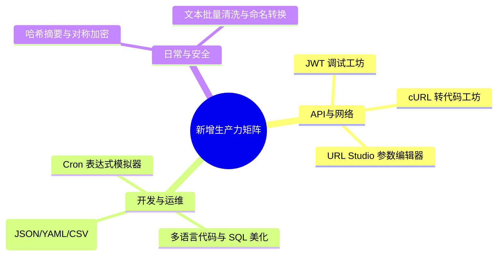
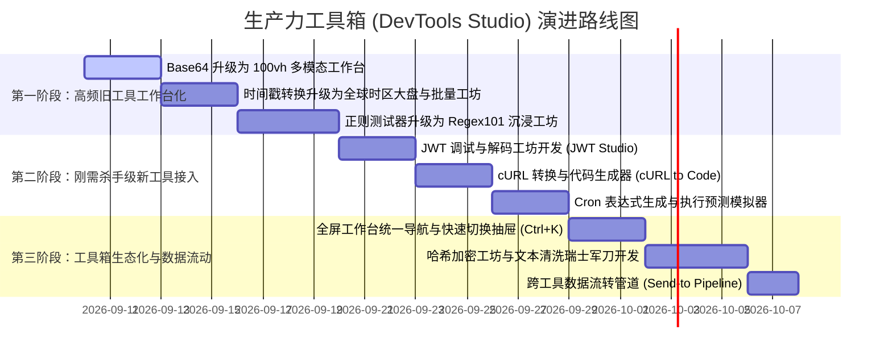

# 生产力工具箱 (DevTools Studio) 沉浸式工作台升级规划书

> **版本**：v3.0 (Workbench Evolution Roadmap)  
> **更新时间**：2026-09  
> **核心定位**：以用户最高频使用的「工具箱」为核心，从传统的“居中小卡片式单点页面”，全面升华为 **“100vh 沉浸式现代开发与效率生产力工作台 (DevTools Studio)”**。  
> **设计基准**：以 `json_tool.html` 的全屏工作台交互模式为标杆，实现视口利用率、操作流程度与视觉质感的质变跃升。

---

## 目录
1. [背景反思与演进目标](#一背景反思与演进目标)
2. [工具箱统一交互架构与设计规范](#二工具箱统一交互架构与设计规范)
3. [已有重点工具“工作台化”翻新方案](#三已有重点工具工作台化翻新方案)
4. [新增高频常用工具矩阵 (8 大生产力工坊)](#四新增高频常用工具矩阵-8-大生产力工坊)
5. [工具间数据联动与状态持久化](#五工具间数据联动与状态持久化)
6. [阶段性实施路线图与优先级](#六阶段性实施路线图与优先级)

---

## 一、背景反思与演进目标

### 1.1 痛点复盘：为什么上个版本没有带来“明显的质感与效率跃升”？
在之前的版本规划中，开发重心偏向于后端底层架构（D1 数据库建表、密码加盐 PBKDF2、Workers AI 与 Telegram 收集箱）。这些改进提升了工程底座，但**脱离了该面板最核心的使用场景**：
- **核心场景错配**：用户打开该聚合面板，绝大多数场景是为了“快速解决手头的一个技术或文本任务”（如格式化 JSON、查时间戳、测正则、编解码）。工具的趁手度才是第一生命线。
- **“居中小卡片”的体验局限**：大多数已有工具采用 `max-width: 900px` 的居中卡片布局。在大屏显示器下，页面两侧留白超过 50%，长内容需要深层次上下滚动，操作按钮分散，缺乏现代生产力工具的专业感。
- **`JSON 格式化` 铺满全屏带来的质变经验**：
  - **视口最大化**：视口固定为 `100vh`，没有外层滚动穿透，空间利用率拉满；
  - **左右分栏联动**：左侧编辑、右侧解析，各自分栏独立滚动；
  - **操作栏一体化**：顶部固定 56px 沉浸式工具栏，复制、压缩、转义、排序一键即达；
  - **质感跃迁**：从“简陋的小网页”直接跃迁为“媲美专业桌面 IDE 的工作台”。

### 1.2 演进目标
本规划将以 `JSON 格式化` 的设计模式为标杆，推进两大维度的深度升级：
1. **已有旧工具全面“工作台化”**：将零散的卡片式工具翻新为统一标准的高效全屏工作台；
2. **补齐开发者极度高频的工具版图**：新增 JWT 调试、cURL 转代码、Cron 表达式、哈希加密、URL Studio 等 8 款刚需神器。

---

## 二、工具箱统一交互架构与设计规范

为了保证整个工具箱的一致性与高质感，后续所有升级工具与新工具遵循统一的 **Workbench UI 规范**：

```
+-----------------------------------------------------------------------------------+
|  [<- 返回]  [应用图标] 应用标题 (v2.0)  |  [工具核心功能按钮组]  |  [快捷切换] [深浅色]  |  -> 56px 固定 Header
+-----------------------------------------------------------------------------------+
|                                                                                   |
|            输入工作区 (Input Area)            |         输出与分析区 (Inspector)     |  -> 100vh 自适应无外层滚动
|         - 语法高亮 / 拖拽上传 / 快捷清空        |       - 结构化树 / 预览 / 差异分析   |
|         - 行号提示 / 格式错误即时标记           |       - 1-Click 一键复制全部         |
|                                               |                                   |
+-----------------------------------------------------------------------------------+
|  [状态提示: 就绪 / 已解析 128 项]             |  [编码: UTF-8]  [字数/行数]  [发送到...]  |  -> 32px 底部状态栏
+-----------------------------------------------------------------------------------+
```

### 2.1 统一页面结构
- **顶部工具条 (Top Navbar, 56px)**：
  - 左侧：优雅的返回主页按钮、应用图标与渐变标题、版本 Badge；
  - 中间：核心操作触发器（如格式化、转换、清空、示例数据加载）；
  - 右侧：工具箱快捷抽屉触发器、主题切换按钮、全屏状态按钮。
- **主工作区 (Main Workspace)**：
  - 采用 Flexbox / CSS Grid 铺满剩余视口 (`height: calc(100vh - 56px - 32px)`)；
  - 各工作面板具备独立的纵向滚动条，支持水平拖拽改变双栏宽度（Resizer Splitter）。
- **底部状态栏 (Status Bar, 32px)**：
  - 实时显示输入字符数、行数、字节大小、执行耗时、语法有效性状态。

### 2.2 工具箱全局无缝切换抽屉 (Tool Switcher Drawer)
- 在任意工具内按 `Ctrl + K` 或点击顶部“工具切换”按钮，均可从侧边滑出半透明毛玻璃抽屉；
- 用户无需退回首页，即可在各个工具之间毫秒级切换，工具状态自动保留在内存中。

---

## 三、已有重点工具“工作台化”翻新方案

| 工具名称 | 当前现状与痛点 | 升级后的全新功能与工作台形态 | 优先级 |
| :--- | :--- | :--- | :--- |
| **1. Base64 互转**<br>`base64_tool.html` | 局促的 900px 居中卡片，两个 textarea 挤在一起，无法预览图片或处理大文件。 | **升级为「多模态数据编解码工作台」**：<br>• **100vh 双栏响应式**：左侧文本/文件输入，右侧输出与操作区；<br>• **拖拽文件即转 Base64**：拖入图片直接生成 Data URL，右侧提供实时图片预览、尺寸信息及一键复制 `` / CSS 引用；<br>• **模式拓展**：增加 `URL-Safe Base64`、`Hex (十六进制) 互转`、`自动换行/去换行`。 | P0 (极高) |
| **2. 时间戳转换**<br>`timestamp_tool.html` | 居中卡片，上下堆叠，页面滚动长，缺乏对比大盘。 | **升级为「全球时区与时间开发者工坊」**：<br>• **全屏动态时区大盘**：单行输入时间，同时实时映射展示：北京时间 (UTC+8)、伦敦 (UTC)、纽约 (EST)、东京 (JST)；<br>• **多行批量转换**：支持一次性粘贴多行日志时间戳并批量转化为人类可读格式；<br>• **代码速查清单**：直接提供 JS, Python, Go, Java, PHP, Rust 获取当前时间戳及互转语法的 1-click 代码片段。 | P0 (极高) |
| **3. 正则表达式测试器**<br>`regex_tool.html` | 居中 1200px 卡片，大量滚动条嵌套，长文本匹配极其笨重。 | **升级为「Regex101 级别全屏工坊」**：<br>• **全屏固定工作台**：上方正则表达式与 Flags 开关，左侧待测文本，右侧捕获组树状分解（Group 1/2...）与即时替换区；<br>• **语法可视化说明**：自动将正则拆解为中文语法解释；<br>• **内置常用规则抽屉**：手机号、邮箱、IPv4/IPv6、URL、身份证、中文字符等一键填入。 | P0 (极高) |
| **4. 密码与凭据生成**<br>`password_generator.html` | 居中小卡片，只能单次生成单个密码，缺乏批量能力。 | **升级为「全功能凭据与安全密钥生成工坊」**：<br>• **全模态生成**：支持密码、UUID (v4/v7)、NanoID、随机 Hex 字符串、API Key 格式；<br>• **批量生成与导出**：一键生成 10/50/100 条并提供一键复制或 `.txt` 导出；<br>• **安全熵分析**：动态展示密码熵值（Bits）及估算暴力破解所需耗时仪表盘。 | P1 (高) |
| **5. 颜色转换器**<br>`color_tool.html` | 只有简单的调色块和输入框，缺乏设计与代码联动。 | **升级为「调色与可访问性设计工坊」**：<br>• **全格式互转**：HEX ↔ RGB ↔ HSL ↔ HSV ↔ CSS 变量；<br>• **WCAG 对比度检查器**：自动测试前景色与背景色的对比度得分，给出 AA/AAA 可访问性标准判定；<br>• **CSS 渐变生成器**：可视化调渐变色，实时生成代码并提供预览卡片。 | P1 (高) |
| **6. Diff 文本对比**<br>`diff_tool.html` | 已经是全屏，但功能偏基础，缺乏高级对比开关。 | **体验深度增强**：<br>• **高级过滤开关**：新增“忽略大小写”、“忽略空白字符”、“行内字符级差异细粒度高亮”；<br>• **文件拖拽对比**：支持直接将两个本地文本或代码文件拖入对比；<br>• **一键左右互换**：便于比对与回退检查。 | P1 (高) |

---

## 四、新增高频常用工具矩阵 (8 大生产力工坊)

以下 8 款工具为开发者与办公日常中**最常用、最高频、纯前端本地秒级计算、绝不上传第三方服务器**的王牌工具：



### 1. 🔐 JWT 调试与解码工坊 (JWT Debugger & Inspector)
- **解决痛点**：排查 Token 鉴权问题时，无需再打开加载缓慢或有隐私泄露风险的第三方网站。
- **功能特性**：
  - **三栏高亮拆解**：自动将 JWT 拆为 Header (红)、Payload (紫)、Signature (蓝)；
  - **JSON 树形格式化**：Payload 内部自动展开为带折叠的高亮 JSON；
  - **过期状态即时判定**：提取 `exp` 与 `iat` 字段，秒级显示“Token 状态：有效（剩余 23分15秒）”或“已过期（过期于 2 小时前）”；
  - **签名验证演练**：支持输入 Secret 进行本地 HMAC-SHA256 签名校验。

### 2. ⚡ cURL 转换与代码生成器 (cURL to Code)
- **解决痛点**：从浏览器开发者工具复制的 `Copy as cURL`，无法直接贴入代码中跑测试。
- **功能特性**：
  - 粘贴任意 cURL 命令，自动解析 URL、Method、Headers、Cookies、Body；
  - **一键多语言代码生成**：
    - JavaScript (Fetch / Axios)
    - Python (requests / httpx)
    - Go (net/http)
    - Node.js (native / undici)
  - 可视化表格展示提取出来的 Header 和 Query 参数，可在线修改并重新生成代码。

### 3. ⏰ Cron 定时任务表达式生成与模拟器 (Cron Studio)
- **解决痛点**：手写 Cron 表达式时经常混淆星期与日期，对执行时间点心里没底。
- **功能特性**：
  - **可视化点击配置**：秒、分、时、日、月、周均提供“每 X 单位”、“指定”、“周期”点选卡片；
  - **双向反向解析**：既支持界面点选生成表达式，也支持输入现有 Cron 表达式自动点亮界面设置；
  - **未来执行预测时间轴**：精准计算并在下方列出该表达式在**未来前 10 次的实际执行时间**，彻底杜绝线上调度事故。

### 4. 🌐 URL 编解码与 Query 参数结构化编辑器 (URL Studio)
- **解决痛点**：长链接嵌套多层 URL encode，参数杂乱难以排查和修改。
- **功能特性**：
  - 输入长链接，自动解析出 Protocol, Host, Port, Pathname, Hash；
  - 将所有 Query Parameters 解析为**交互式键值对表格**；
  - 支持直接在表格中勾选启用/禁用、编辑值、新增参数，并在顶部实时同步拼装出完整的新 URL；
  - 支持常用编码模式：`encodeURI`、`encodeURIComponent`、Base64 内嵌解码。

### 5. 🛡️ 哈希摘要与对称加解密工坊 (Hash & Crypto Studio)
- **解决痛点**：需要计算 MD5、SHA256、AES 加解密时找不到无广告的纯净本地工具。
- **功能特性**：
  - **多哈希并行计算**：单次输入文本，一键同步计算出 MD5、SHA-1、SHA-256、SHA-512、SM3；
  - **对称加解密 (AES / DES)**：
    - 支持 AES-CBC, AES-ECB, AES-GCM 模式；
    - 支持 Key、IV 自定义输入，输出格式可选 Base64 / Hex；
    - 纯浏览器原生 Web Crypto / CryptoJS 本地运算，保证数据绝不上云。

### 6. 🧹 多语言代码与 SQL 美化压缩器 (Code & SQL Formatter)
- **解决痛点**：日志中抓取的单行超长 SQL 或压缩后的 HTML/CSS 无法排版阅读。
- **功能特性**：
  - 100vh 左右双栏结构；
  - **SQL 格式化**：关键字自动大写、AND/OR/JOIN 缩进对齐、子查询换行缩进；
  - **Web 代码格式化**：HTML, CSS, JavaScript 一键美化与一键极速压缩 (Minify)。

### 7. 🔄 数据格式互转工坊 (Data Converter: JSON ↔ YAML ↔ CSV ↔ XML)
- **解决痛点**：不同系统间配置文件（JSON / YAML）或报表数据（JSON 数组 / CSV）手工转换繁琐。
- **功能特性**：
  - 左右分栏，左侧选源格式，右侧选目标格式，输入内容即时双向转换；
  - 语法错误定位与行号高亮标记；
  - 支持将 CSV 导出为 Excel 兼容的 `.csv` 文件。

### 8. 🧰 文本批量清洗与排版瑞士军刀 (Text Cleaner)
- **解决痛点**：整理数据、编写代码时频繁需要去除重复、整理空格、变量命名风格转换。
- **功能特性**：
  - **批量清洗工具箱**：一键去除重复行、去除空行、按首字母升降序排列、行首行尾批量添加字符、去除首尾空格；
  - **命名格式一键转换**：
    - `camelCase` (小驼峰)
    - `PascalCase` (大驼峰)
    - `snake_case` (下划线)
    - `kebab-case` (中划线)
    - `CONSTANT_CASE` (常量大写)
  - 全量字符数、英文字数、中文字数、行数与占用字节统计。

---

## 五、工具间数据联动与状态持久化

打造真正的“工作台生态”，不能让每个小工具成为孤岛：

### 5.1 本地工作区草稿自动保存 (Local Draft Persistence)
- 每一个工作台工具均在 `localStorage` 中维护专用状态键（如 `dev_draft_base64`, `dev_draft_regex`）；
- 刷新页面或意外关闭标签后重新打开，自动恢复上一次的输入草稿，避免心血白费。

### 5.2 跨工具数据管道 (Data Pipeline / Relay)
在每个工具的底部状态栏增加 **「发送到... (Send to)」** 联动按钮：
- 在 **正则测试器** 中提取匹配出来的 JSON 字符串 ➔ 一键发送并在 **JSON 格式化** 中打开；
- 在 **Base64 互转** 中解码出来的文本 ➔ 一键发送并在 **Diff 文本对比** 中对比；
- 在 **cURL 转换器** 中解析出来的 Body ➔ 一键发送并在 **JSON 格式化** 中美化；
- 在 **JWT 调试器** 中解码的 Payload ➔ 一键发送并在 **JSON 格式化** 中修改。

---

## 六、阶段性实施路线图与优先级



### 推荐的立项第一步
优先改造 **Base64 互转工具 (`base64_tool.html`)**：
1. 从 900px 居中卡片升级为 `100vh` 左右双栏；
2. 引入文件/图片直接拖拽转 Base64 与右侧即时渲染预览；
3. 将统一的 56px 顶部沉浸 Header 规范验证打磨成型，为后续所有工具提供通用标准模板。
